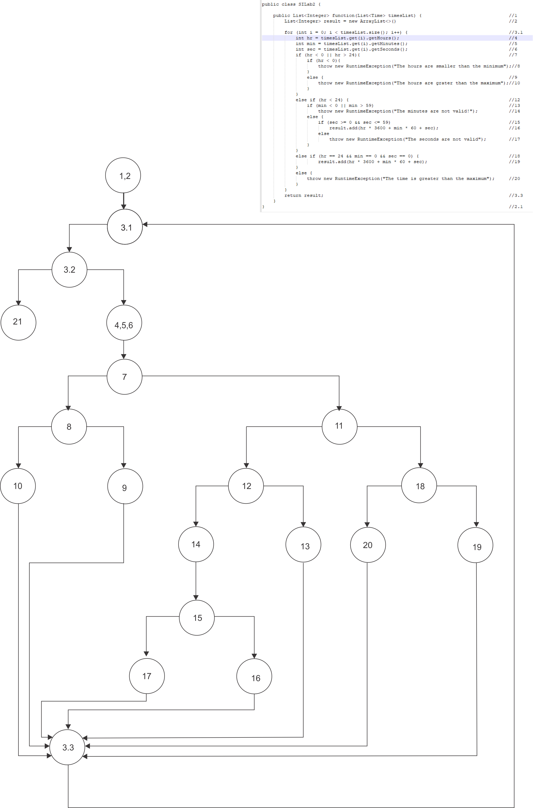

# Лабораториска вежба број 2 
Ивана Камчевска, бр. на индекс 173197

# Control Flow Graph

### Цикломатска комплексност

Цикломатскта комплексност на графот се одредува со формулите E-N+2 каде што 
- Е е бројот на врски
- N е бројот на јазли  
- P е предикатни јазли.
Бројот на јазли е 20, а бројот на врски е 26, па од тоа следува 26-20+2=8.
Или пак по формулата: P+1 каде што
- P е предикатни јазли. ( Предиктни јазли се: 2.1, 3, 4, 7, 8, 10 и 13.)
Од формулата P+1 добиваме 7+1=8

### Тест случаи според критериумот Multiple condition

if (hr < 0 || hr > 24)

|Combination|Possible test case|Branch |
|-----------|------------------|-------|
|FT  (T)    | 26               |7,8-10 |
|FF  (F)    | 5                |7-11   |
|TX  (T)    | -5               |7,8-9  |

if (min < 0 || min > 59)

|Combination|Possible test case|Branch    |
|-----------|------------------|----------|
|TX (T)     |-12               |12-13     |
|FT (T)     |65                |12-13     |
|FF (F)     |44                |12,14-15  |

 if (sec >= 0 && sec <= 59)

|Combination|Possible test case|Branch    |
|-----------|------------------|----------|
|TТ (T)     |37                |15-16     |
|TF (F)     |62                |15-17     |
|FX (F)     |-12               |15-17     |

if (hr == 24 && min == 0 && sec == 0)

|Combination|Possible test case|Branch    |
|-----------|------------------|----------|
|TТT (T)    |24:0:0            |18-19     |
|TTF (F)    |24:0:15           |18-20     |
|TFT (F)    |24:5:0            |18-20     |
|FFT (F)    |15:5:0            |18-20     |

###  unit tests
- За Multiple condition со тест случај го проверувам првиот услов 
и условот во него дали се точни во тој случај доколку се точни враќаме соодветен исклучок.

- За Every branch со тест случај внесувам време кое го задоволува условите во првиот elseif
 и соодветно ја задавам очекуваната вредност за секунди која треба да ми ја врати во резултатот. 
